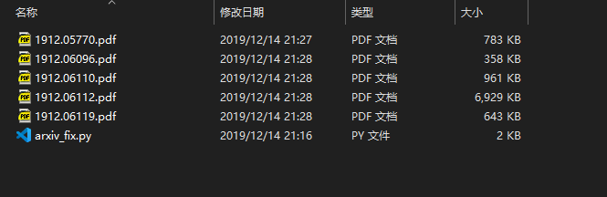
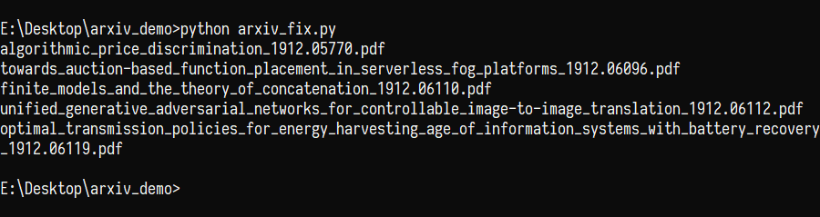
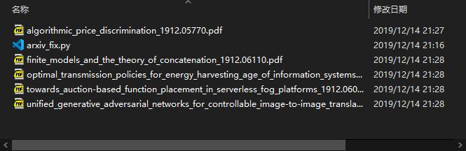

# arxiv_fix
A modern solution to a modern problem

## Demo

Before:



In progress: 



After:



## How to use

Package installation:

```
pip install -r requirements.txt
```

Once you're ready, 

```
python arxiv_fix.py 
```

Or if you want some customization, try:

```
python arxiv_fix.py -h
```

And then you're done:star: